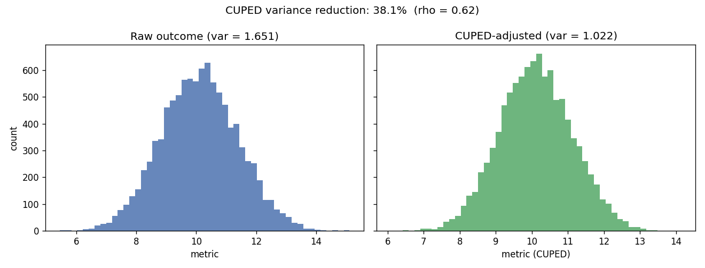
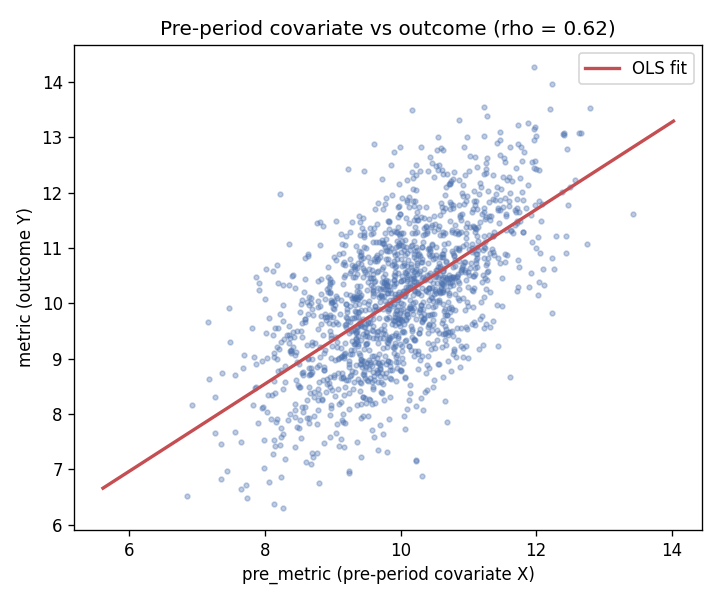
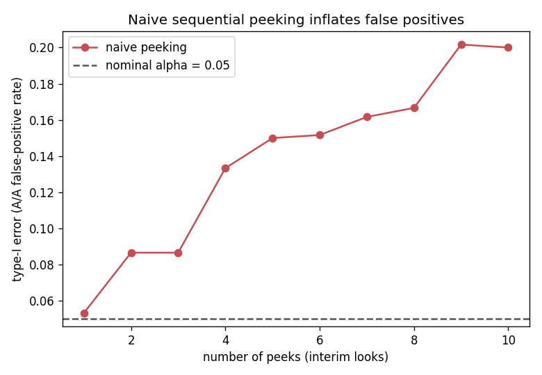

# ab-test-toolkit

A small, reusable **A/B test analysis toolkit** plus a worked, end-to-end report.
It packages the statistics an experimentation analyst reaches for every day —
power & sample-size planning, frequentist tests with confidence intervals, CUPED
variance reduction — and it is honest about the two pitfalls that quietly ruin
real experiments: **multiple comparisons** and **sequential peeking**.

Everything runs on **synthetic, seeded data** generated by a script in this repo
(`python -m ab.data`). There is no external dataset, no company data, and no
credentials anywhere.

> Author: Aditya Singh Rathore ([`ducal7`](https://github.com/ducal7)) · MIT licensed.

---

## Why this exists (problem framing)

Shipping a feature behind an A/B test sounds simple, but the analysis is where
most teams lose money:

- **Under-powered tests** declare "no effect" when they simply lacked the sample
  size to see one. You need to size the experiment *before* you run it.
- **Noisy metrics** widen confidence intervals so much that real wins look flat.
  If you logged a pre-experiment covariate, **CUPED** can remove a big chunk of
  that noise for free.
- **Peeking** at the dashboard and stopping "once it's significant" inflates the
  false-positive rate far above the 5% you think you're running at.
- **Many metrics / many variants** multiply your chances of a fluke "win".

This toolkit gives you a clean, tested implementation of each piece and a report
that demonstrates them on data with a *known* ground truth, so you can see the
methods actually recovering the truth.

## What each piece does

| Module | Responsibility |
| --- | --- |
| `ab.power` | Sample-size & power calculators for two proportions and two-sample means (normal approximation, balanced design). |
| `ab.stats_tests` | Pooled **two-proportion z-test** and **Welch (unequal-variance) t-test**, each returning a point estimate, statistic, two-sided p-value, and a confidence interval. |
| `ab.cuped` | **CUPED** variance reduction: `theta = cov(Y,X)/var(X)`, `Y_cuped = Y - theta·(X - mean X)`; reports the achieved variance reduction. |
| `ab.corrections` | Guardrails for the pitfalls: **Bonferroni** & **Benjamini-Hochberg** for multiple comparisons, a **Pocock** per-look alpha for sequential designs, and a simulation that quantifies how naive peeking inflates type-I error. |
| `ab.data` | Seeded synthetic experiment generator with a **configurable true effect** and a **pre-period covariate** (so CUPED has something to exploit). |
| `ab.report` | End-to-end worked report: generate → power → test + CI → CUPED → plots/tables. |

### The two pitfalls, documented

**Multiple comparisons.** Testing `m` independent true nulls at `alpha` gives a
family-wise false-positive probability of `1 - (1 - alpha)^m` — about **40%** for
ten metrics at `alpha = 0.05`. Use `bonferroni` to control the family-wise error
rate, or `benjamini_hochberg` to control the (more powerful) false-discovery rate.

**Sequential peeking.** Re-running a fixed-horizon test after every batch of users
and stopping the first time `p < alpha` is not a 5% test — every peek is another
chance to cross the line. `peeking_false_positive_rate` measures this by
simulating an A/A test (no true effect): with **10 naive looks the false-positive
rate rises to ~20%** versus the nominal 5% (see the plot below). The principled
fixes are group-sequential **alpha-spending** boundaries (Pocock /
O'Brien-Fleming, exposed via `pocock_alpha`) or always-valid sequential tests.

## Install & run

Requires **Python 3.11**.

```bash
# 1. Create an environment and install (pinned deps in pyproject.toml)
python3.11 -m venv .venv && source .venv/bin/activate
pip install -e ".[dev]"

# 2. Regenerate the synthetic dataset (deterministic)
make data        # == python -m ab.data

# 3. Run the full worked report (writes plots + tables to results/)
make report      # == python -m ab.report

# 4. Quality gates
make lint        # ruff check .
make test        # pytest
make all         # lint + test + data + report
```

`python -m ab.data --true-effect 0.5 --seed 7` lets you dial the ground-truth
effect and seed from the command line.

## Results (worked example)

Generated by `python -m ab.report` on the default seeded experiment
(`n = 5000` per arm, configured true continuous effect `= 0.20`, conversion lift
`= 0.04`, covariate correlation `rho ≈ 0.62`). Numbers below are committed in
[`results/metrics.json`](results/metrics.json) and reproduce exactly.

**Power planning (a priori).** To detect the true effect at `alpha = 0.05`, power
`0.80`: **393 users/arm** for the continuous metric, **1683 users/arm** for the
conversion lift. The experiment ran 5000/arm, so it is comfortably powered.

**Primary metric — Welch t-test, naive vs CUPED:**

| | Estimate | p-value | 95% CI | CI half-width |
| --- | --- | --- | --- | --- |
| Naive | **0.2736** | < 1e-6 | [0.2235, 0.3237] | 0.0501 |
| CUPED | **0.2584** | < 1e-6 | [0.2191, 0.2977] | 0.0393 |

CUPED keeps the **same unbiased effect estimate** but shrinks the confidence
interval by ~22% (half-width 0.0501 → 0.0393), driven by a
**38.1% reduction in outcome variance** (1.651 → 1.022, `theta = 0.789`).

**Secondary metric — conversion (two-proportion z-test):** control `0.2012`,
treatment `0.2314`, lift `+0.0302`, **p = 0.000245**, 95% CI `[0.0141, 0.0463]`.

**Peeking pitfall:** a no-effect A/A test peeked at 10 times falsely "wins"
**~19.8%** of the time at nominal `alpha = 0.05`; the Pocock per-look threshold
that restores an overall 5% error is **0.0106**.

### Committed plots

| | |
| --- | --- |
| CUPED variance reduction |  |
| Covariate vs outcome (why CUPED works) |  |
| Naive peeking inflates false positives |  |

A machine-readable summary lives in [`results/metrics.json`](results/metrics.json)
and a rendered table in [`results/results_table.md`](results/results_table.md).

## Tests

`pytest` covers the things that actually matter:

- power/sample-size math against hand-computed reference values
  (`p=0.5 vs 0.6 → 388/arm`; Cohen `d=0.5 → 63/arm`);
- the Welch test agrees with `scipy.stats.ttest_ind` to 1e-10, and both tests
  recover significance on synthetic data with a known effect;
- CUPED genuinely lowers variance (≈ `rho^2`) while preserving the effect
  estimate and tightening the CI versus the naive estimator;
- the generator is deterministic per seed and keeps the covariate balanced;
- naive peeking inflates the false-positive rate above nominal.

## Project layout

```
ab-test-toolkit/
├── src/ab/            # the reusable package
│   ├── power.py  stats_tests.py  cuped.py  corrections.py
│   ├── data.py        # python -m ab.data
│   └── report.py      # python -m ab.report
├── tests/             # pytest suite
├── results/           # committed plots + metrics (regenerated by the report)
├── pyproject.toml     # pinned deps, ruff & pytest config (Python 3.11)
├── Makefile           # data / report / test / lint / all
└── .github/workflows/ci.yml   # ruff + pytest on Python 3.11
```

## License

MIT — see [LICENSE](LICENSE). Copyright (c) 2026 Aditya Singh Rathore.
